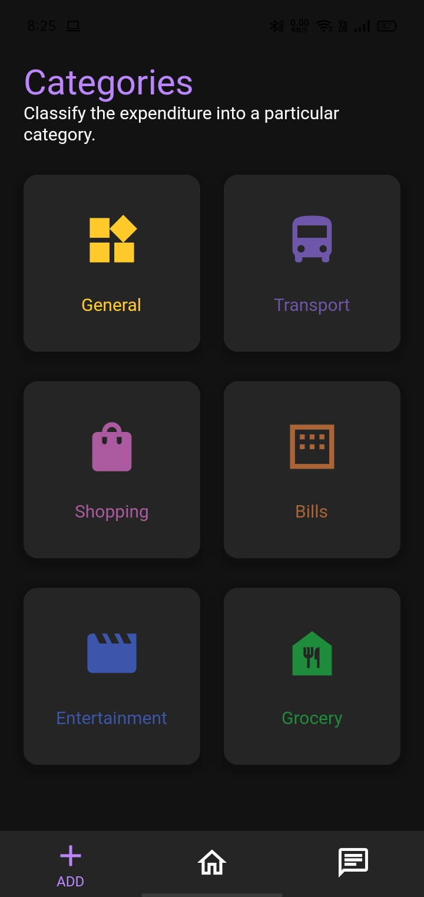
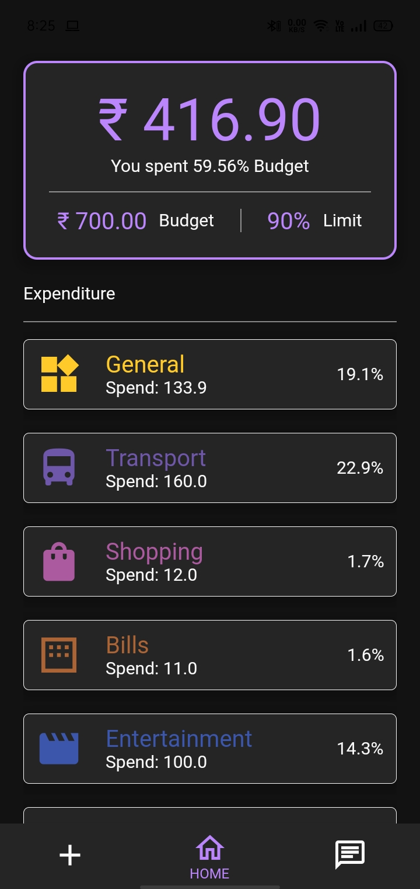
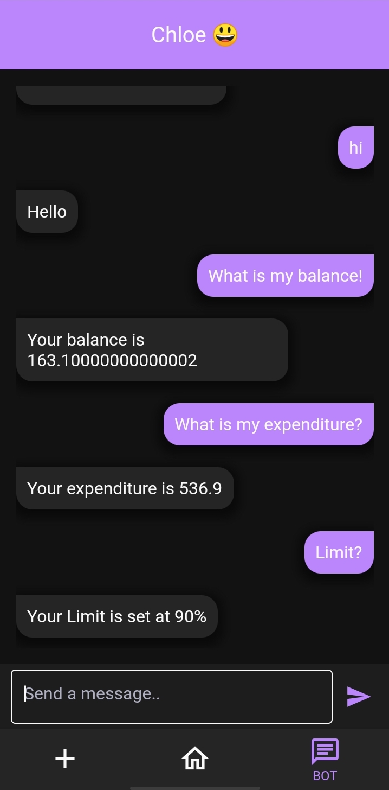

<h1 align="center">

</h1>

## Problem statement:
Managing personal finances isn’t the easiest thing to do. Sometimes it can feel overwhelming. Small expenses may seem irrelevant at the time but can add up to a great part of your budget. A leading cause of poor money management is due to the lack of financial knowledge. For some strange reason, schools don't teach financial literacy skills. Yet, these are critical for proper financial planning.

## Solution:
In this hack we intend to solve the problem at hand by building an easy to use app to help keep track of the user’s expenses. Chloe is an AI powered personal financial assistant residing in the app, designed to help educate the user towards financial independence. 

Tech stack: 

• Flutter • dart • firebase • python • chatterbot • flask • nltk • sqlite3 •

## Methodology:
After signing up/logging in, the user will initially be able to set a budget and spend limit. After each expense, the user can input the item name and amount spent for one of the 6 categories. The app will help you make sure you stay within the budget. The user can also chat with Chloe, who can answer any questions related to finance and also questions like “What is my expenditure?”, “What is my balance?”, “What is my budget?”, etc. Chloe is built using the chatterbot python library which uses a selection of machine learning algorithms to produce different types of responses.

## Prototype:

  
  
  

